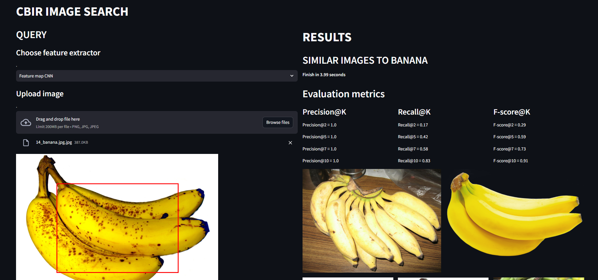

# CBIR - Content-Based Image Retrieval

This project implements a CBIR system using fruit images and various visual feature extraction methods, such as colour histograms, raw pixels, Bag of Words (BoW), autoencoder, and VGG19 feature maps. Extracted features are indexed with FAISS to retrieve images similar to a query. The solution includes a web interface to visualize results.

##  :file_folder: File Structure
```
.
├── cbir_aapi
│   ├── database
│   │   ├── db.csv
│   │   ├── feat_extract_1
│   │   ├── feat_extract_2
│   │   ├── feat_extract_3
│   │   ├── feat_extract_4
│   │   └── feat_extract_5
│   ├── images
│   ├── app.py
│   ├── autoencoder_model.keras
│   ├── codebook.npy
│   └── requirements.txt
├── code
│   ├── Extractor 1 - CNN
│   │   ├── Extractor 1_img_retrieval.py
│   │   └── feat_extract_1
│   ├── Extractor 2 - BoW
│   │   ├── codebook.npy
│   │   ├── Extractor 2_img_retrieval.py
│   │   └── feat_extract_2
│   ├── Extractor 3 - Autoencoder
│   │   ├── autoencoder_model.keras
│   │   ├── Extractor 3 - Autoencoder_img_retrieval.py
│   │   ├── Extractor 3 - Autoencoder
│   │   └── feat_extract_3
│   ├── Extractor 4 - Raw Pixels
│   │   ├── Extractor 4_img_retrieval.py
│   │   └── feat_extract_4
│   ├── Extractor 5 - Color Histogram
│   │   ├── Extractor 5_img_retrieval.py
│   │   └── feat_extract_5
│   ├── Preprocessing
│   │   ├── db.csv
│   │   └── Preprocessing_CBIR.py
└── README.md
```

## :page_facing_up:Folder Description
 - **`cbir_aapi`**: it contains all the necessary dependencies for running the application in a web interface.
	- **`database`**:  it contains the FAISS feature extraction indexes for all methods and the `db.csv`.
	- **`images`**:  it contains the original dataset images.
	- **`app.py`**:  script `.py` for running the application web interface.
	- **`codebook.npy`**:  codebook for BoW extractor.
	- **`autoencoder_model.keras`**:  trained autoencoder model used in that extractor.
	- **`requirements.txt`**: necessary dependencies to run the script `app.py`
 - **`code/`**: it contains all the developed code for the project:
	- **`Extractor 1 - CNN/`**:  it contains the script `Extractor 1_img_retrieval.py` for this method and the FAISS feature extraction index. In order to run it properly, directory should be changed as appropiate.	
	- **`Extractor 2 - BoW/`**:  it contains the script `Extractor 2_img_retrieval.py` for this method and the FAISS feature extraction index. Moreover, the `codebook.npy` is obtained once the script has been run and it is used during retrieval. In order to run it properly, directory should be changed as appropiate.		
	- **`Extractor 3 - Autoencoder/`**:  it contains the script `Extractor 3_img_retrieval.py` for this method and the FAISS feature extraction index.	Furthermore, the `autoencoder_model.keras` is obtained once the script has been run and it is used during retrieval. In order to run it properly, directory should be changed as appropiate.		
	- **`Extractor 4 - Raw Pixels/`**:  it contains the script `Extractor 4_img_retrieval.py` for this method and the FAISS feature extraction index. In order to run it properly, directory should be changed as appropiate.	
	- **`Extractor 5 - Color Histogram/`**:  it contains the script `Extractor 5_img_retrieval.py` for this method and the FAISS feature extraction index. In order to run it properly, directory should be changed as appropiate.	
		- **`Preprocessing/`**:  the original dataset `Fruits`  may be download from [here](https://www.kaggle.com/datasets/kritikseth/fruit-and-vegetable-image-recognition/data)  and allocate in this directory. Moreover, the folder `Fruits_Preprocessed` will be created once preprocessing script `Preprocessing_CBIR.py` has been run and `Fruits` directory has been located in this directory.  For  it  to  work  properly,  the  directory  must  be  changed  accordingly. The `db.csv` file is necessary for running the application as it has a column named *images* where all the dataset images names are for retrieval and indexing purposes.


⚠️ **Note**: To properly download large files using `Git Large File Storage (git lfs)`, ensure not to delete `.gitattributes` files in the repository. These guarantee the correct handling of large files, such as FAISS feature indexes.


## :notebook: Requirements


- Python >= 3.8


##  :package: Installation


1. Clone this repository on your local machine and move into the folder `cbir_aapi` of your cloned repository:


    ```bash

    git clone https://github.com/rubykoom/CBIR_AAPI_2024.git
    
     ```
    
     ```bash
    cd CBIR_AAPI_2024/cbir_aapi

    ```


2. Create a virtual environment (optional but recommended):


    ```bash

    python -m venv cbir_env

    ```


    On Windows:

    ```bash

    cbir_env\Scripts\activate 

    ```


    On macOS/Linux:

    ```bash

    source cbir_env/bin/activate

    ```


3. Install the dependencies:


    ```bash

    pip install -r requirements.txt

    ```


## :zap: Execution

To start the application, use the following command:

```bash

streamlit run app.py

```
Afterwards, you may try the application with the `Test` folder in the `Fruits_Preprocessed` directory (see Folder Description section).

The web interface has a movable red rectangle to select the area that will be used as the query in the retrieval of similar images.





## :star: Authors
- [Rubén Sánchez Fernández](https://github.com/rubykoom)
- [Paula Velasco López](https://github.com/PauVL)


